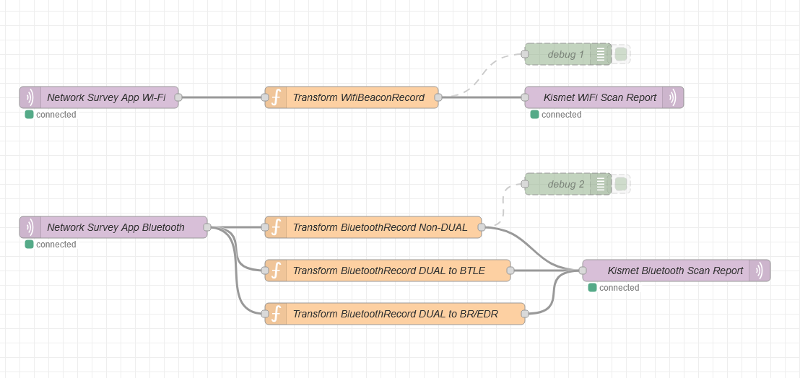

+++
date = '2025-07-06T07:35:18-04:00'
draft = false
title = 'Kismet MQTT'
+++

Kismet currently supports MQTT ingest from RTL433. I was hoping to use Kismet's MQTT datasource to ingest WiFi and Bluetooth scans from the [Network Survey App](https://www.networksurvey.app/). Unfortunately, the MQTT datasource is currently specific to the RTL433 MQTT format.

To support mode MQTT sources, I [started a feature branch](https://github.com/hobobandy/kismet/tree/dev/feature/mqtt) and added support for at least [WiFi scan reports](https://www.kismetwireless.net/docs/api/wifi_scanningmode/) and [Bluetooth scan reports](https://www.kismetwireless.net/docs/api/bluetooth_scanningmode/).

Initially, I thought I'd have to create a translator from the App's format to Kismet's format, then I remembered of [Node-RED](https://nodered.org/). Since I'm running a Home Assistant server now, I added the Node-RED community add-on and created the following flow for each scan type to do the translation:



## MQTT IN Topics

WiFi: `80211_beacon_message`

Bluetooth: `bluetooth_message`

## MQTT OUT Topics

WiFi: `DOT11SCAN`

Bluetooth: `BLUETOOTHSCAN`

## Functions

### WiFi

```
let timestamp = Date.parse(msg.payload.data.deviceTime);

let capabilities = [];

if (msg.payload.data.encryptionType != "")
    capabilities.push(`[${msg.payload.data.encryptionType}]`);
if (msg.payload.data.wps == true)
    capabilities.push("[WPS]");

msg.payload = {
    identity: msg.payload.data.deviceName,
    timestamp: Math.round(timestamp / 1000),
    ssid: msg.payload.data.ssid,
    bssid: msg.payload.data.bssid,
    capabilities: capabilities.join(""),
    channel: msg.payload.data.channel.toString(),
    freqkhz: msg.payload.data.frequencyMhz,
    signal: msg.payload.data.signalStrength,
    lat: msg.payload.data.latitude,
    lon: msg.payload.data.longitude,
    alt: msg.payload.data.altitude,
    spd: msg.payload.data.speed
};

return msg;
```

### Bluetooth

#### Non-DUAL

```
if (msg.payload.data.supportedTechnologies == "DUAL") {
    return;
}

let devicetype = "BT";

switch (msg.payload.data.supportedTechnologies) {
    case "LE":
        devicetype = "BTLE";
    case "BR_EDR":
        devicetype = "BR/EDR";
}

let timestamp = Date.parse(msg.payload.data.deviceTime);

msg.payload = {
    identity: msg.payload.data.deviceName,
    timestamp: Math.round(timestamp / 1000),
    btaddr: msg.payload.data.sourceAddress,
    name: msg.payload.data.otaDeviceName,
    devicetype: devicetype,
    signal: msg.payload.data.signalStrength,
    lat: msg.payload.data.latitude,
    lon: msg.payload.data.longitude,
    alt: msg.payload.data.altitude,
    spd: msg.payload.data.speed
};

return msg;
```

#### DUAL to BTLE

```
if (msg.payload.data.supportedTechnologies != "DUAL") {
    return;
}

let timestamp = Date.parse(msg.payload.data.deviceTime);

msg.payload = {
    identity: msg.payload.data.deviceName,
    timestamp: Math.round(timestamp / 1000),
    btaddr: msg.payload.data.sourceAddress,
    name: msg.payload.data.otaDeviceName,
    devicetype: "BTLE",
    signal: msg.payload.data.signalStrength,
    lat: msg.payload.data.latitude,
    lon: msg.payload.data.longitude,
    alt: msg.payload.data.altitude,
    spd: msg.payload.data.speed
};

return msg;
```

#### DUAL to BR/EDR

```
if (msg.payload.data.supportedTechnologies != "DUAL") {
    return;
}

let timestamp = Date.parse(msg.payload.data.deviceTime);

msg.payload = {
    identity: msg.payload.data.deviceName,
    timestamp: Math.round(timestamp / 1000),
    btaddr: msg.payload.data.sourceAddress,
    name: msg.payload.data.otaDeviceName,
    devicetype: "BR/EDR",
    signal: msg.payload.data.signalStrength,
    lat: msg.payload.data.latitude,
    lon: msg.payload.data.longitude,
    alt: msg.payload.data.altitude,
    spd: msg.payload.data.speed
};

return msg;
```