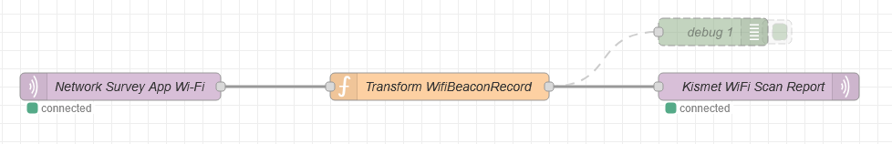
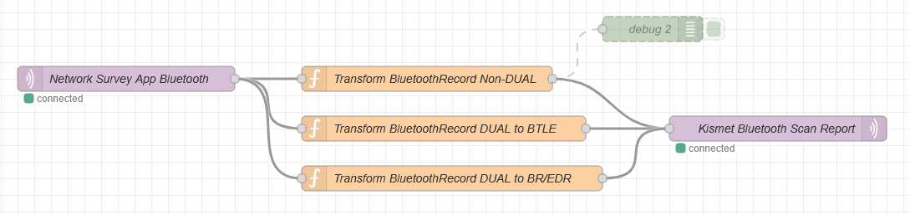
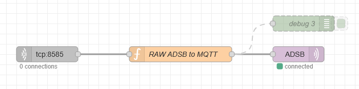

+++
date = '2025-07-06T07:35:18-04:00'
draft = false
title = 'Kismet MQTT'
+++

Kismet currently supports MQTT ingest from RTL433. I was hoping to use Kismet's MQTT datasource to ingest WiFi and Bluetooth scans from the [Network Survey App](https://www.networksurvey.app/). Unfortunately, the MQTT datasource is currently specific to the RTL433 MQTT format.

To support more MQTT sources, I [started a feature branch](https://github.com/hobobandy/kismet/tree/dev/feature/mqtt) and added the logic required to support at least [WiFi scan reports](https://www.kismetwireless.net/docs/api/wifi_scanningmode/), [Bluetooth scan reports](https://www.kismetwireless.net/docs/api/bluetooth_scanningmode/), and ADS-B raw hex from [readsb](https://github.com/wiedehopf/readsb).

## Kismet Source Definition

Part of the feature branch is to fix the current authentication logic to allow user/pass authentication without TLS.

I still need to test the TLS logic, my MQTT broker isn't configured to use TLS yet.

The `mapping` in the source definition is case-sensative, and I still need to confirm other data types.

The following config doesn't differentiate MQTT sensors:

```
source=mqtt:host=127.0.0.1,port=1883,topic=DOT11SCAN/#,mapping=DOT11SCAN,user=kismet,password=kismet
source=mqtt:host=127.0.0.1,port=1883,topic=BLUETOOTHSCAN/#,mapping=BLUETOOTHSCAN,user=kismet,password=kismet
source=mqtt:host=127.0.0.1,port=1883,topic=ADSB/#,mapping=adsb,user=kismet,password=kismet
```

If you want to differentiate MQTT sensors in the Kismet web interface, then do something like:

```
source=mqtt:host=127.0.0.1,port=1883,topic=DOT11SCAN/EmeraldTucan20,mapping=DOT11SCAN,user=kismet,password=kismet,name=MQTT-WIFI-EmeraldTucan20
source=mqtt:host=127.0.0.1,port=1883,topic=DOT11SCAN/LavenderShark53,mapping=DOT11SCAN,user=kismet,password=kismet,name=MQTT-WIFI-LavenderShark53
```

**NOTE:** I still need to confirm how to differentiate between ADS-B sources.

## ADS-B Runtime Command

Change the `--net-connector` parameters to reflect where your Node-RED instance resides and the port its listening on for ADS-B messages.

```
readsb --quiet --device-type rtlsdr --gain auto --net --net-connector=127.0.0.1,8585,raw_out
```

## Node-RED Configuration

Initially, I thought I'd have to create a translator from the App's format to Kismet's format, then I remembered of [Node-RED](https://nodered.org/). Since I'm running a Home Assistant server now, I added the Node-RED community add-on and created the following flow for each scan type to do the translation:

### WiFi



#### MQTT Topics

* MQTT IN Topic: `80211_beacon_message`

* MQTT OUT Topic: Leave blank (it is set in the function below)

#### Function

```
let timestamp = Date.parse(msg.payload.data.deviceTime);

let capabilities = [];

if (msg.payload.data.encryptionType != "")
    capabilities.push(`[${msg.payload.data.encryptionType}]`);
if (msg.payload.data.wps == true)
    capabilities.push("[WPS]");

msg.topic = `DOT11SCAN/${msg.payload.data.deviceName}`;

msg.payload = {
    timestamp: Math.round(timestamp / 1000),
    ssid: msg.payload.data.ssid,
    bssid: msg.payload.data.bssid,
    capabilities: capabilities.join(""),
    channel: msg.payload.data.channel.toString(),
    freqkhz: msg.payload.data.frequencyMhz,
    signal: msg.payload.data.signalStrength,
    lat: msg.payload.data.latitude,
    lon: msg.payload.data.longitude,
    alt: msg.payload.data.altitude,
    spd: msg.payload.data.speed
};

return msg;
```

### Bluetooth



#### MQTT Topics

- MQTT IN Topic: `bluetooth_message`
- MQTT OUT Topic: Leave blank (it is set in the functions below)

#### Functions

##### Non-DUAL

```
if (msg.payload.data.supportedTechnologies == "DUAL") {
    return;
}

let devicetype = "BT";

switch (msg.payload.data.supportedTechnologies) {
    case "LE":
        devicetype = "BTLE";
    case "BR_EDR":
        devicetype = "BR/EDR";
}

let timestamp = Date.parse(msg.payload.data.deviceTime);

msg.topic = `BLUETOOTHSCAN/${msg.payload.data.deviceName}`;

msg.payload = {
    timestamp: Math.round(timestamp / 1000),
    btaddr: msg.payload.data.sourceAddress,
    name: msg.payload.data.otaDeviceName,
    devicetype: devicetype,
    signal: msg.payload.data.signalStrength,
    lat: msg.payload.data.latitude,
    lon: msg.payload.data.longitude,
    alt: msg.payload.data.altitude,
    spd: msg.payload.data.speed
};

return msg;
```

##### DUAL to BTLE

```
if (msg.payload.data.supportedTechnologies != "DUAL") {
    return;
}

let timestamp = Date.parse(msg.payload.data.deviceTime);

msg.topic = `BLUETOOTHSCAN/${msg.payload.data.deviceName}`;

msg.payload = {
    timestamp: Math.round(timestamp / 1000),
    btaddr: msg.payload.data.sourceAddress,
    name: msg.payload.data.otaDeviceName,
    devicetype: "BTLE",
    signal: msg.payload.data.signalStrength,
    lat: msg.payload.data.latitude,
    lon: msg.payload.data.longitude,
    alt: msg.payload.data.altitude,
    spd: msg.payload.data.speed
};

return msg;
```

##### DUAL to BR/EDR

```
if (msg.payload.data.supportedTechnologies != "DUAL") {
    return;
}

let timestamp = Date.parse(msg.payload.data.deviceTime);

msg.topic = `BLUETOOTHSCAN/${msg.payload.data.deviceName}`;

msg.payload = {
    timestamp: Math.round(timestamp / 1000),
    btaddr: msg.payload.data.sourceAddress,
    name: msg.payload.data.otaDeviceName,
    devicetype: "BR/EDR",
    signal: msg.payload.data.signalStrength,
    lat: msg.payload.data.latitude,
    lon: msg.payload.data.longitude,
    alt: msg.payload.data.altitude,
    spd: msg.payload.data.speed
};

return msg;
```

### ADS-B



#### TCP IN

* Type: `Listen on` port `8585`
* Output: `stream of` `String`
* Leave `delimited by` empty

#### MQTT Topic

* MQTT OUT Topic: `ADSB`

#### Function

`.trim()` is critical to remove the extra whitespace at the start of payload.

```
msg.payload = {
    adsb: msg.payload.trim(),
};

return msg;
```